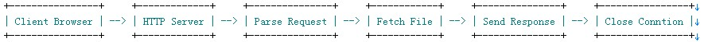

# 第一步

## 目标

文件浏览器

## 目标

使用 GET 方法 列出当前目录或者配置目录的内容，类似 nginx  index 功能。

## 需要实现的功能点

- [x] tcp 交互 (socket/bind/listen/accept)
- [x] 解析 http request
- [x] 处理 URL 路由
- [x] 响应 http response

注：
不考虑过于复杂的东西，只实现 GET


## HTTP 流程




## 说明

*学习性质，不要在任何服务器上对公网部署！！！*

第一次写 socket 程序，所以是想到哪里写到哪里，所以代码看起来千奇百怪。下一步会进行整理。


## 运行

在当前目录执行 `php -f server.php`

简单配置如下（直接修改 server.php 即可）

```php
<?php
define("HTTP_IP", "127.0.0.1");     // 绑定 ip
define("HTTP_PORT", "9876");        // 端口
define("ROOT_PATH", "/");   // 指定浏览目录
```

## Socket Errors (http://php.net/manual/zh/sockets.errors.php)

```
Socket扩展编写的目的是提供一个面向功能强大的BSD Socket的可用的接口。
它能确保这些函数在Win32和Unix平台上都能很好的工作。 
在特定条件下，大部分socket函数如果发生错误都会发出一个 E_WARNING信息描述错误内容。
有时可能并不会如开发者所愿。例如，因为连接突然中断， socket_read()函数可能会突然发出一个 E_WARNING。 
通常会使用@操作符来压制异常，然后在程序中用socket_last_error()来捕获错误代码。 
你可以调用socket_strerror()函数通过错误代码获取错误描述。查看函数描述获取更多信息。
```